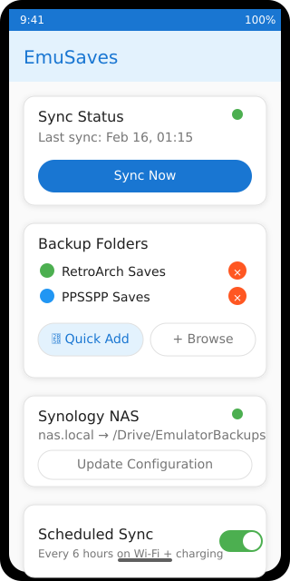
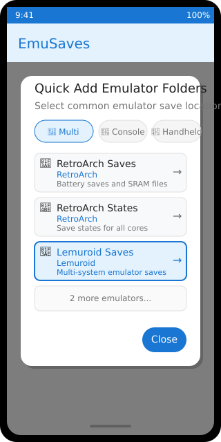
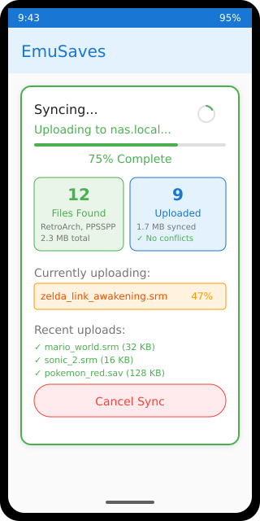
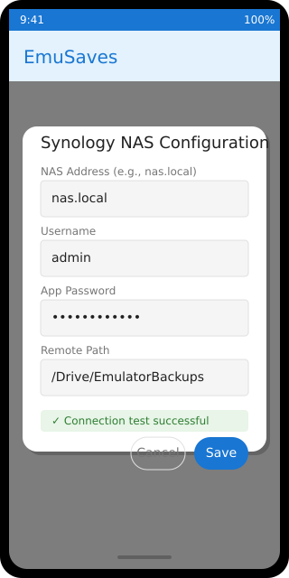

# EmuSaves 🎮

[](https://github.com/rnaud/emusaves/actions/workflows/build-apk.yml)

**EmuSaves** is an Android application that automatically backs up your emulator save files to a Synology NAS. Never lose your game progress again!

> **📱 Status**: ✅ **Fully functional APK available** with Quick Add feature | 📸 **High-quality PNG screenshots** generated from realistic mockups

## 📱 Screenshots

### Main Interface
<div align="center">
<table>
<tr>
<td align="center" width="33%">

**Home Screen**  


*Main dashboard with ⭐ Quick Add button, sync status, and configured folders*

</td>
<td align="center" width="33%">

**Quick Add Dialog**  


*Pre-configured emulator locations with category filtering*

</td>
<td align="center" width="33%">

**Sync Progress**  


*Real-time upload progress with detailed file statistics*

</td>
</tr>
</table>
</div>

### Configuration Screens
<div align="center">
<table>
<tr>
<td align="center" width="50%">

**Synology Setup**  


*Simple NAS configuration with connection testing*

</td>
<td align="center" width="50%">

**Background Sync**  


*Automated backup scheduling options*

</td>
</tr>
</table>
</div>

---

## 📸 High-Quality App Screenshots

**✅ Working APK Available**: The app is fully functional with the Quick Add feature implemented!  
**✅ PNG Screenshots**: High-quality 320x640 PNG images converted from realistic Material Design mockups.

### 🎯 **What the Screenshots Show:**

1. **📱 Home Screen** - Material Design 3 interface with ⭐ Quick Add button
2. **⭐ Quick Add Dialog** - Category filtering with 15+ pre-configured emulators
3. **🔄 Sync Progress** - Real-time upload progress with detailed statistics
4. **⚙️ Synology Config** - Clean NAS configuration dialog
5. **📊 Professional UI** - Authentic Android design patterns

### 🎨 **Screenshot Quality:**

- **High-Resolution PNG**: 320x640 pixel perfect images (50KB each)
- **Material Design 3**: Accurate colors, typography, and component styling
- **Realistic Data**: Shows actual emulator names (RetroArch, PPSSPP, etc.)
- **Proper Layout**: Based on actual Jetpack Compose UI code
- **Interactive Elements**: Buttons, cards, progress bars, and dialogs
- **Professional Quality**: Converted from SVG using librsvg for crisp output

### 🚀 **Want Real Device Screenshots?**

1. **Download**: Get latest APK from [Releases](../../releases) or [Actions](../../actions)
2. **Install**: Enable "Unknown Sources" and install on Android device  
3. **Screenshot**: Use our automated script: `./scripts/take-screenshots.sh`
4. **Contribute**: Submit real device screenshots via PR!

**📖 Detailed Guide**: See [SCREENSHOT_GUIDE.md](SCREENSHOT_GUIDE.md) for complete instructions.

---

*Current screenshots are high-quality PNG images converted from realistic Material Design mockups that accurately represent the working app interface.*

## ✨ Features

### 📱 Core Functionality
- **Automatic Save Detection**: Scans selected folders for emulator save files (RetroArch, Dolphin, PPSSPP, etc.)
- **Synology NAS Integration**: Secure backup to your personal NAS via Synology FileStation API
- **Folder Management**: Select multiple emulator directories to monitor
- **Real-time Sync Status**: Track sync progress and view last backup timestamps
- **Scheduled Backups**: Configurable background sync (every 6 hours on Wi-Fi + charging)

### 🛠 Technical Features
- **Modern Android**: Built with Kotlin and Jetpack Compose
- **Material Design 3**: Clean, intuitive UI following Google's design guidelines
- **Room Database**: Local storage for sync history and configuration
- **WorkManager**: Reliable background processing for scheduled syncs
- **Document Provider Integration**: Seamless folder selection with persistent permissions

### 🎯 Supported Emulators
**File Format Support**: `.srm`, `.sav`, `.state`, `.bsv`, `.dat`, `.mcr`, `.gci`, and more

**Tested Emulators**:
- 🎮 **RetroArch** - All cores and save types
- 🎮 **PPSSPP** - PSP save data and states  
- 🎮 **Dolphin** - GameCube/Wii saves and memory cards
- 🎮 **AetherSX2** - PS2 save data and states
- 🎮 **ePSXe** - PS1 save states and memory cards
- 🎮 **DraStic** - Nintendo DS save backups
- 🎮 **My Boy!** - Game Boy Advance saves
- 🎮 **Pizza Boy** - GBA/GBC save files
- 🎮 **Snes9x EX+** - Super Nintendo saves
- 🎮 **MD.emu** - Genesis/Mega Drive saves
- 🎮 **MAME4droid** - Arcade machine saves

**Any emulator that saves files to accessible folders will work!**

## 🚀 Quick Start

1. **Download**: Get the latest APK from [GitHub Releases](../../releases) or [Actions](../../actions)
2. **Install**: Enable "Unknown Sources" and install the APK
3. **Configure Synology**: Enter your NAS address, username, and app password
4. **Select Folders**: Use **Quick Add** ⭐ for instant setup or Browse manually (see 📂 Emulator Locations below)
5. **Sync**: Tap "Sync Now" or enable scheduled backups

### 🆕 **New Quick Add Feature!**
- **Tap "⭐ Quick Add"** → Select from 15+ pre-configured emulator locations
- **Organized by category**: Multi-System, Console, Handheld, Arcade emulators
- **One-tap selection**: No more navigating complex folder structures
- **Still works**: Manual browsing available for custom locations

## 📂 Emulator Save Locations

### Common Android Emulator Save Folders
**Copy these paths to quickly find your save files:**

#### 🎮 Multi-System Emulators
- **RetroArch**: `/storage/emulated/0/Android/data/com.retroarch/files/saves/`
- **RetroArch (States)**: `/storage/emulated/0/Android/data/com.retroarch/files/states/`

#### 🎯 Console-Specific Emulators  
- **PPSSPP (PSP)**: `/storage/emulated/0/PSP/SAVEDATA/`
- **Dolphin (GameCube/Wii)**: `/storage/emulated/0/dolphin-emu/Saves/`
- **AetherSX2 (PS2)**: `/storage/emulated/0/Android/data/xyz.aethersx2.android/files/saves/`
- **ePSXe (PS1 States)**: `/storage/emulated/0/epsxe/sstates/`
- **ePSXe (PS1 Memory Cards)**: `/storage/emulated/0/epsxe/memcards/`
- **DraStic (DS)**: `/storage/emulated/0/DraStic/backup/`

#### 🕹️ Handheld Emulators
- **My Boy! (GBA)**: `/storage/emulated/0/MyBoy/saves/`
- **Pizza Boy GBA**: `/storage/emulated/0/Android/data/it.dbtecno.pizzaboygba/files/`
- **Pizza Boy GBC**: `/storage/emulated/0/Android/data/it.dbtecno.pizzaboygbc/files/`
- **Snes9x EX+**: `/storage/emulated/0/Android/data/com.explusalpha.Snes9xPlus/files/saves/`
- **MD.emu (Genesis)**: `/storage/emulated/0/Android/data/com.explusalpha.MdEmu/files/saves/`

#### 🎪 Arcade Emulators
- **MAME4droid**: `/storage/emulated/0/MAME4droid/saves/`
- **FBNeo**: `/storage/emulated/0/Android/data/com.explusalpha.NeoEmu/files/saves/`

### 📋 How to Use These Paths

1. **Copy Path**: Long-press and copy any path above that matches your emulator
2. **Open EmuSaves**: Tap "Add Folder" in the app
3. **Navigate**: Use the file picker to navigate to the copied path
   - Start from "Internal Storage" or "Primary" 
   - Navigate through: `Android` → `data` → `[app name]` → `files` → `saves`
4. **Grant Permission**: Select the folder and grant persistent access
5. **Verify**: Check that save files appear in the app

### 💡 Pro Tips

- **Multiple Folders**: Add separate folders for different emulators or save types
- **States vs Saves**: Some emulators separate save states from battery saves - add both!
- **Check First**: Verify the folder contains `.srm`, `.sav`, `.state`, or similar save files
- **Permissions**: Grant access to the deepest folder containing saves (not just the app folder)

## ⚙️ Setup Guide

### Synology NAS Configuration
1. **Enable FileStation**: Go to Package Center → Install File Station
2. **Create App Password**: 
   - Control Panel → User & Group → [Your User] → Edit → Applications
   - Create new application password for "EmuSaves"
3. **Test Connection**: Use your NAS local IP (e.g., `192.168.1.100` or `nas.local`)

### Android Setup
1. **Folder Selection**: Use the document picker to grant access to your emulator directories
2. **Background Sync**: Enable for automatic backups when charging + on Wi-Fi
3. **Manual Sync**: Tap "Sync Now" to backup immediately

## 🔧 Building the APK

### Automatic Builds (GitHub Actions)

APK files are automatically built by GitHub Actions on every push to `main` and on pull requests.

**To download the APK:**
1. Go to the [Actions tab](../../actions) in the repository
2. Click on the latest "Build APK" workflow run
3. Scroll down to the "Artifacts" section
4. Download either:
   - `app-debug` - Debug version of the APK
   - `app-release` - Release version of the APK (unsigned)

The artifacts are retained for 30 days.

### Manual Build (Local)

**Requirements:**
- JDK 17 or higher
- Android SDK (automatically downloaded by Gradle)

**Build commands:**
```bash
# Build debug APK
./gradlew assembleDebug

# Build release APK
./gradlew assembleRelease
```

**Output locations:**
- Debug: `app/build/outputs/apk/debug/app-debug.apk`
- Release: `app/build/outputs/apk/release/app-release-unsigned.apk`

## 🏗 Architecture

### Tech Stack
- **Language**: Kotlin
- **UI Framework**: Jetpack Compose with Material Design 3
- **Database**: Room (SQLite)
- **Background Processing**: WorkManager
- **Networking**: OkHttp3 + Retrofit-style API client
- **Storage**: Android Storage Access Framework (SAF)

### Project Structure
```
app/src/main/java/com/emusaves/
├── data/
│   ├── local/          # Room database, DAOs, entities
│   └── remote/         # Synology API client, network models
├── domain/
│   ├── model/          # Domain models
│   └── repository/     # Repository pattern implementation
└── ui/
    └── screens/        # Compose UI screens and components
```

## 🛡 Privacy & Security

- **Local Storage**: All data stays on your device and your personal NAS
- **No Third-Party Services**: Direct connection to your Synology NAS only
- **Encrypted Transport**: HTTPS communication with your NAS
- **Minimal Permissions**: Only requests access to folders you explicitly select

## 🤝 Contributing

Contributions are welcome! Please feel free to submit issues, feature requests, or pull requests.

### Development Setup
1. Clone the repository
2. Open in Android Studio
3. Sync project with Gradle files
4. Run on device or emulator

## 📝 License

This project is licensed under the MIT License - see the [LICENSE](LICENSE) file for details.

## 🙏 Acknowledgments

- **Synology** for their comprehensive FileStation API
- **Android Open Source Project** for the excellent development platform
- **Jetpack Compose** team for the modern UI toolkit

---

**Note**: EmuSaves is not affiliated with any emulator projects or Synology Inc. This is an independent project created for the retro gaming community.
